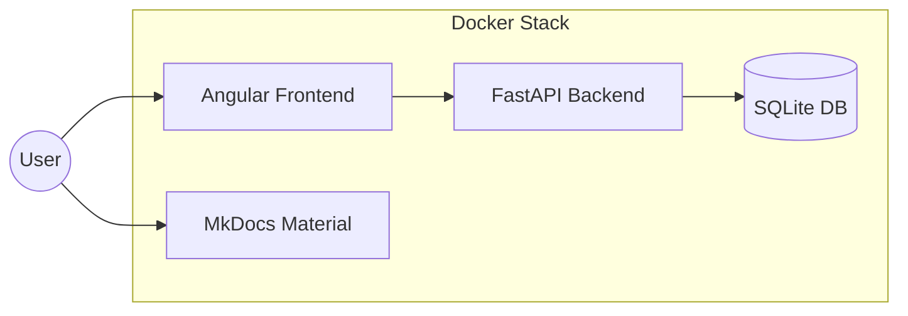

# Architecture

## Communication Canvas

This project follows a structured architectural approach to ensure maintainability, scalability, and clear separation of concerns.

### Value Proposition & Core Functionality

The application aims to make historical weather data accessible and analyzable.
*   **Core Value**: Easy access to long-term climate data for specific locations.
### System Architecture

### Components & Technologies

The system is divided into two main containers orchestrated via Docker Compose.

#### 1. Backend (Python/FastAPI)
*   **Technology Stack**: Python 3.12+, FastAPI, SQLite, Pandas.
*   **Performance Optimizations**: 
    *   **GZip Compression**: All JSON responses are compressed on-the-fly, reducing station metadata payloads by ~85%.
    *   **Persistent Caching**: Uses SQLite to store both station metadata and aggregated temperature records.
*   **Data Strategy**:
    *   **Lazy Ingestion**: Temperature records are only downloaded and processed when requested for the first time.
    *   **Pre-aggregation**: Daily NOAA records are aggregated into Annual/Seasonal averages during ingestion for sub-millisecond query performance later.

#### 2. Frontend (Angular)
*   **Technology Stack**: Angular 19, PrimeNG, Leaflet, Chart.js.
*   **State Management**: Uses **Angular Signals** for synchronous, reactive UI state (e.g., current station selection, search radius).
*   **Visualization Logic**: Custom Chart.js plugins and segment styling to handle data gaps gracefully (dashed bridging).

### Infrastructure & Deployment

*   **Docker Orchestration**: The entire stack is containerized.
*   **Persistent Volumes**: SQLite databases are stored in a Docker volume (`/app/data`) to ensure persistence across container restarts.
*   **Reverse Proxy**: In production-like builds, Nginx serves the static Angular assets and proxies API requests to the FastAPI backend.

## Design Decisions

*   **SQLite over PostgreSQL**: Chosen for its zero-configuration nature and portability. For a read-heavy historical dataset, file-based storage provides excellent performance with minimal overhead.
*   **Pandas for ETL**: Leverages highly optimized C-extensions for processing large NOAA CSV files during the "on-demand" ingestion phase.
*   **Dashed Line Gap Detection**: Decided to use visual bridging (dashed lines) instead of breaking the line graph. This maintains the "trend" visualization while legally communicating where data is missing.
*   **Signal-based Search**: Decoupling the "Search Pin" position from the "Search Action" to allow for a more interactive and stable user experience.
