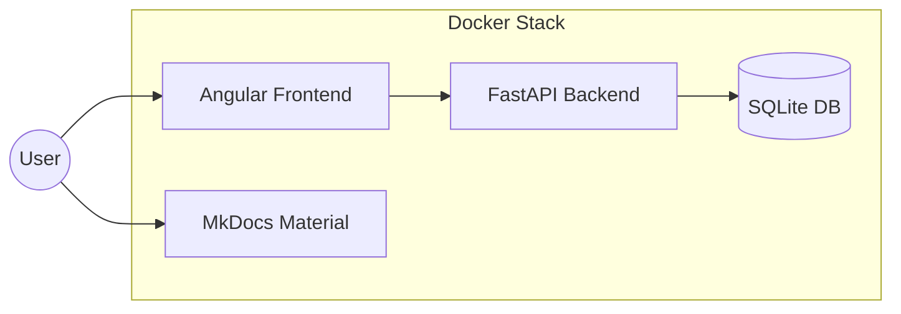
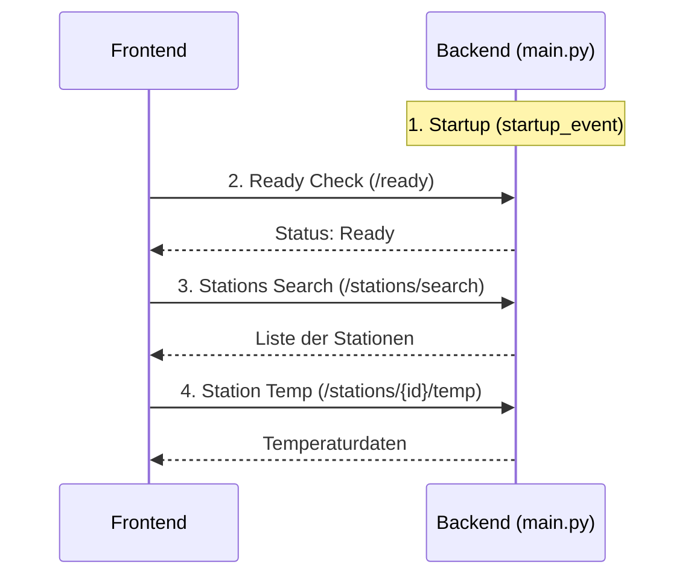

# Architektur

### Systemarchitektur

### Komponenten & Technologien

Das System ist in zwei Hauptcontainer unterteilt, die via Docker Compose orchestriert werden.

#### 1. Backend (Python/FastAPI)
*   **Technologie-Stack**: Python 3.12+, FastAPI, SQLite, Pandas.
*   **Performance-Optimierungen**: 
    *   **Persistentes Caching**: Nutzt SQLite, um sowohl Stationsmetadaten als auch aggregierte Temperaturdatensätze zu speichern.
*   **Datenstrategie**:
    *   **Lazy Ingestion**: Temperaturdatensätze werden erst heruntergeladen und verarbeitet, wenn sie zum ersten Mal angefragt werden.
    *   **Vor-Aggregation**: Tägliche NOAA-Datensätze werden während der Ingestion zu jährlichen/saisonalen Durchschnittswerten aggregiert, um spätere Abfragen im Sub-Millisekunden-Bereich zu ermöglichen.

#### 2. Frontend (Angular)
*   **Technologie-Stack**: Angular 19, PrimeNG, Leaflet, Chart.js.
*   **State Management**: Nutzt **Angular Signals** für synchronen, reaktiven UI-Status (z. B. aktuelle Stationsauswahl, Suchradius).

### Infrastruktur & Deployment

*   **Docker-Orchestrierung**: Der gesamte Stack ist containerisiert.
*   **Persistente Volumes**: SQLite-Datenbanken werden in einem Docker-Volume (`/app/data`) gespeichert, um die Persistenz über Container-Neustarts hinweg zu gewährleisten.