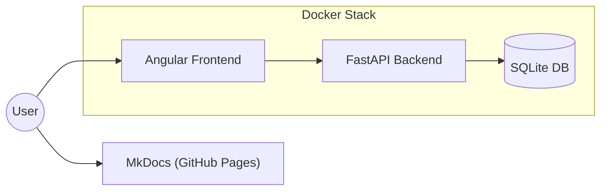
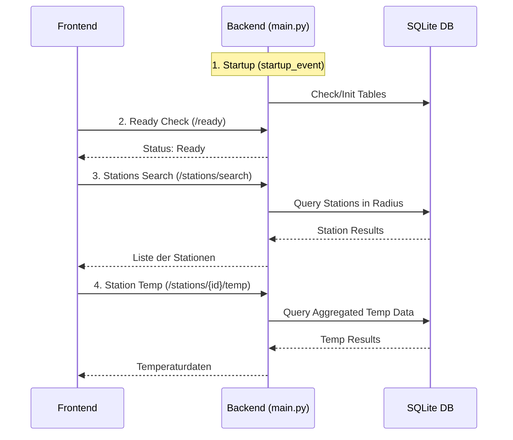

# Architektur

## Architecture Communication Canvas

Ein Überblick über die architektonischen Entscheidungen und Rahmenbedingungen des Projekts.

-   !!! success "Value Proposition"
        **Wofür bauen wir das?**
        
        Bereitstellung eines intuitiven Tools zur Visualisierung und Analyse historischer Wetterdaten, um klimatische Trends einfach explorierbar zu machen.

-   !!! success "Key Stakeholder"
        **Für wen bauen wir das?**
        
        *   **Studenten & Dozenten**: Für Lehre und Forschung.
        *   **Entwickler**: Als Referenzprojekt für "Clean Architecture".

-   !!! success "Business Context"
        **Umfeld & Integrationen**
        
        *   **Hochschulprojekt**: Semester 5 - Projektrealisierung.
        *   **Datenquelle**: NOAA (National Oceanic and Atmospheric Administration) Global Corp.
        *   **Karten**: OpenStreetMap & Leaflet.

-   !!! success "Quality Requirements"
        **Qualitätsziele**
        
        *   **Effizienz**: Kernfunktionen < 3s, Interaktionen < 0.5s (Lighthouse Performance).
        *   **Inclusivität**: Barrierefreiheit nach Lighthouse-Standard.
        *   **Wartbarkeit**: Modulare Code-Struktur ("Clean Architecture"), Testabdeckung & CI/CD.

-   !!! success "Core Functions"
        **Was leistet das System?**
        
        *   Interaktive **Kartensuche** mit Radius.
        *   **Datenvisualisierung** (Graphen) für Temperaturverläufe.
        *   **Konfigurierbare** Parameter (Zeitraum, Radius).
        *   Integrierte **Dokumentation**.

-   !!! info "Core Decisions"
        **Wichtige Entscheidungen**
        
        *   **Draggable Pin**: Intuitive Definition des Suchradius durch visuelles "Drag & Drop".
        *   **Gap Handling**: Darstellung fehlender Messwerte als "Lücken" im Graphen statt Interpolation (Verfälschung vermeiden).
        *   **Docker-First**: Einheitliche Umgebung für Dev & Prod.
        *   **Lazy Ingestion**: Daten werden nur bei Bedarf geladen ("On-Demand").
        *   **Vor-Aggregation**: Performance-Optimierung beim Import.

-   !!! info "Components"
        **Bausteine (Module & Services)**
        
        *   **Station Import Service**: Verantwortlich für Download und Parsing der NOAA Daten.
        *   **Aggregation Engine**: Transformiert rohe Tagesdaten in Jahresdurchschnitte.
        *   **Map Module**: Leaflet-Wrapper für Karteninteraktion.
        *   **Data View Module**: Chart.js Integration zur Visualisierung.

-   !!! info "Technologies"
        **Tech Stack**
        
        *   Frontend: `Angular`, `TypeScript`, `Leaflet`, `Chart.js`
        *   Backend: `Python 3.12`, `FastAPI`, `Pandas`, `SQLite`
        *   Ops: `Docker`, `Docker Compose`, `Nginx`

-   !!! failure "Risks & Missing Info"
        **Risiken & Unbekannte**
        
        *   **Daten-Abhängigkeit**: Ausfall oder Strukturänderung der NOAA API blockiert den Import neuer Stationen.
        *   **Daten-Vollständigkeit**: Historische Lücken (z.B. Weltkriege) führen zu unvollständigen Graphen.
        *   **Performance-Spikes**: Der allererste Abruf einer Station kann je nach Netzwerk > 3s dauern (Initialer Import).

---

### Systemarchitektur

```mermaid
graph LR
    User((User))
    subgraph "Docker Stack"
        Frontend[Angular Frontend]
        Backend[FastAPI Backend]
        DB[("SQLite DB")]
    end
    Docs["MkDocs (GitHub Pages)"]
    
    User --> Frontend
    User --> Docs
    Frontend --> Backend
    Backend --> DB
```

```mermaid
sequenceDiagram
    participant FE as Frontend
    participant BE as Backend (main.py)
    participant DB as SQLite DB

    Note over BE: 1. Startup (startup_event)
    BE->>DB: Check/Init Tables
    FE->>BE: 2. Ready Check (/ready)
    BE-->>FE: Status: Ready
    FE->>BE: 3. Stations Search (/stations/search)
    BE->>DB: Query Stations in Radius
    DB-->>BE: Station Results
    BE-->>FE: Liste der Stationen
    FE->>BE: 4. Station Temp (/stations/{id}/temp)
    BE->>DB: Query Aggregated Temp Data
    DB-->>BE: Temp Results
    BE-->>FE: Temperaturdaten
```

### Komponenten & Technologien

Das System ist in zwei Hauptcontainer unterteilt, die via Docker Compose orchestriert werden.

#### 1. Backend (Python/FastAPI)
*   **Technologie-Stack**: Python 3.12+, FastAPI, SQLite, Pandas.
*   **Performance-Optimierungen**: 
    *   **Persistentes Caching**: Nutzt SQLite, um sowohl Stationsmetadaten als auch aggregierte Temperaturdatensätze zu speichern.
*   **Datenstrategie**:
    *   **Lazy Ingestion**: Temperaturdatensätze werden erst heruntergeladen und verarbeitet, wenn sie zum ersten Mal angefragt werden.
    *   **Vor-Aggregation**: Tägliche NOAA-Datensätze werden während der Ingestion zu jährlichen/saisonalen Durchschnittswerten aggregiert, um spätere Abfragen im Sub-Millisekunden-Bereich zu ermöglichen.

#### 2. Frontend (Angular)
*   **Technologie-Stack**: Angular 19, PrimeNG, Leaflet, Chart.js.
*   **State Management**: Nutzt **Angular Signals** für synchronen, reaktiven UI-Status (z. B. aktuelle Stationsauswahl, Suchradius).

### Infrastruktur & Deployment

*   **Docker-Orchestrierung**: Der gesamte Stack ist containerisiert und läuft als in sich geschlossenes System.
*   **Persistente Volumes**: SQLite-Datenbanken werden in einem Docker-Volume (`/app/data`) gespeichert, um die Persistenz über Container-Neustarts hinweg zu gewährleisten.

#### Docker-Betrieb & Lokale Ausführung
Die Anwendung besteht aus einem Multi-Container Setup, welches durch `docker-compose.yml` orchestriert wird:
1.  **Backend (`weather_api`)**: Ein Python-basierter Container (`python:3.11-slim`), der die FastAPI-Anwendung über den schnellen Uvicorn-Server asynchron auf Port `8000` ausführt.
2.  **Frontend (`weather_app`)**: Ein mehrstufiger Build (`node` zum Kompilieren der Angular-Dateien, `nginx:alpine` zum Ausliefern). Nginx dient dabei als leichtgewichtiger, ultraschneller Webserver auf Port `8080`, der die statischen Dateien zudem via "GZIP" vorkomprimiert ausliefert (Performance Score).

**Kommunikation der Container**: 
Frontend und Backend befinden sich im selben isolierten Docker-Netzwerk. Das Angular-Frontend kommuniziert jedoch klassisch über das Host-System auf das Backend (CORS und Ports werden entsprechend verwaltet), oder – falls ein Reverse Proxy wie Nginx davor geschaltet wäre – direkt über Host-Header-Routings.

Mit dem simplen Befehl `docker-compose up --build` wird der komplette Verbund vollautomatisch hochgefahren und benötigt keinerlei weitere lokale Installationen (wie Python-Envs, Node-Modules oder Datenbank-Server). Dies repräsentiert das **"Zero-Configuration"**-Prinzip.

### Architectural Decision Records (ADRs)

Im Folgenden werden wesentliche Architekturentscheidungen dokumentiert.

#### ADR 0001: Verwendung von Angular als Frontend-Framework

##### Kontext

Es wird ein robustes Framework für eine Single Page Application benötigt. Das Team profitiert von einer starken Struktur ("Opinionated Framework") und Typsicherheit durch TypeScript. Reines JavaScript oder kleinere Libraries wie React bieten weniger out-of-the-box Architekturvorgaben.

##### Entscheidung

Wir verwenden **Angular** in der aktuellen Version 19.

##### Status

Accepted

##### Konsequenzen

*   (+) Klare Architekturvorgaben (Services, Components, Modules) fördern die Wartbarkeit.
*   (+) Hervorragende TypeScript-Integration.
*   (+) Performantes State-Management durch die neuen **Signals**.
*   (-) Höhere initiale Lernkurve und mehr "Boilerplate" als bei minimalistischen Frameworks.

---

#### ADR 0002: Verwendung von FastAPI als Backend

##### Kontext

Die Anwendung verarbeitet historische Wetterdaten. Python ist im Data-Science-Kontext (Pandas) führend. Klassische Frameworks wie Django sind für reine Microservices zu schwergewichtig, Flask bietet weniger Typ-Sicherheit.

##### Entscheidung

Wir verwenden **FastAPI**.

##### Status

Accepted

##### Konsequenzen

*   (+) Sehr hohe Performance (Starlette-basiert).
*   (+) Automatische Generierung von OpenAPI-Dokumentation (Swagger UI).
*   (+) Starke Typisierung und Validierung mittels Pydantic.
*   (-) Asynchrone Programmierung in Python erfordert sauberen Umgang mit Blocking-Code (z.B. Pandas-Operationen).

---

#### ADR 0003: Verwendung von SQLite als Datenbank

##### Kontext

Die Anwendung soll einfach installierbar ("portable") sein und ohne komplexe Datenbank-Server auskommen. Die Daten sind relational (Stationen, Messwerte), aber überwiegend statisch (Read-Heavy) nach dem initialen Import.

##### Entscheidung

Wir speichern Daten in einer lokalen **SQLite**-Datei auf einem Docker-Volume.

##### Status

Accepted

##### Konsequenzen

*   (+) Zero-Configuration: Keine separaten User/Ports/Server nötig.
*   (+) Einfaches Backup durch Kopieren der Datei.
*   (+) Ausreichende Performance für die angefallenen Datenmengen durch Indizierung.
*   (-) Keine Concurrency bei Schreibzugriffen (Write-Locking), was aber durch den Lazy-Ingestion-Ansatz (sequentielles Laden) mitigiert wird.

---

#### ADR 0004: Verwendung von Leaflet für die Karte

##### Kontext

Die App benötigt eine interaktive Karte zur Auswahl von Orten. Google Maps ist kostenpflichtig und restriktiv. OpenLayers ist sehr mächtig, aber komplex in der Handhabung.

##### Entscheidung

Wir nutzen **Leaflet** in Verbindung mit OpenStreetMap-Tiles.

##### Status

Accepted

##### Konsequenzen

*   (+) Open Source und kostenlos.
*   (+) Leichtgewichtig und einfach in Angular zu integrieren.
*   (+) Unterstützung für mobile Touch-Gesten.
*   (-) Weniger integrierte "POI"-Daten als Google Maps (reines Kartenmaterial).

---

#### ADR 0005: Draggable Pin Interaktion

##### Kontext

Nutzer müssen einen geografischen Mittelpunkt festlegen. Die manuelle Eingabe von Lat/Lon-Koordinaten ist fehleranfällig und nicht benutzerfreundlich. Ein einfacher Klick ist oft unpräzise oder erfordert Bestätigung.

##### Entscheidung

Implementierung eines **verschiebbaren Markers (Draggable Pin)**, der den aktuellen Suchradius und Mittelpunkt visuell repräsentiert.

##### Status

Accepted

##### Konsequenzen

*   (+) Intuitives Bedienkonzept ("Direct Manipulation").
*   (+) Sofortiges visuelles Feedback: Nutzer sieht, wo er sucht.
*   (-) Erfordert Synchronisation zwischen UI-Inputs (Textfelder) und Karten-Marker (Two-Way-Binding).

---

#### ADR 0006: Integrierte Dokumentation

##### Kontext

Technische Dokumentation veraltet oft, wenn sie extern (z.B. Wiki, PDF) gepflegt wird. Sie soll Teil des Entwicklungsprozesses sein ("Docs-as-Code").

##### Entscheidung

Wir pflegen die Dokumentation (MkDocs) im selben Repository und spielen sie automatisiert über **GitHub Actions auf GitHub Pages** aus.

##### Status

Accepted

##### Konsequenzen

*   (+) Dokumentation und Code sind im selben Repository versioniert.
*   (+) Weltweite Verfügbarkeit ohne Performance-Hit auf dem eigenen Server.
*   (+) "Zero-Maintenance" Hosting dank GitHub Pages.
*   (-) Erfordert CI/CD Pipeline Konfiguration (.github/workflows).