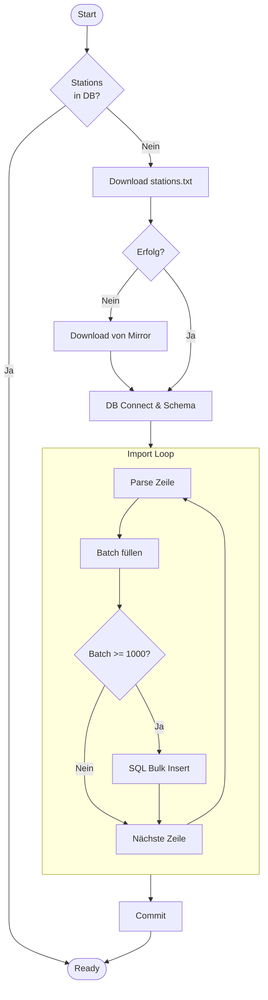

# import_stations.py

### Ablauf


### Main
??? Code
    ```
    def main():
        try:
            download_file(STATIONS_URL, STATIONS_TXT)
        except Exception as e:
            logging.warning(f"Primary URL failed: {e}. Trying fallback...")
            download_file(NOA_STATIONS_URL, STATIONS_TXT)

        conn = sqlite3.connect(DB_PATH)
        create_schema(conn)
        import_stations(conn, STATIONS_TXT)
        conn.close()
    ```

Die `main`-Funktion koordiniert den Download und den Import der globalen Wetterstations-Metadaten in die lokale Datenbank.

*   **Fallback-Mechanismus**: Versucht die Stationsliste von der primären Quelle zu laden und nutzt bei Fehlern eine alternative NOAA-Quelle, um die Robustheit des Setups zu erhöhen.
*   **Datenbank-Setup**: Stellt die Verbindung zur SQLite-DB her und stellt über `create_schema` sicher, dass die erforderlichen Tabellen existieren.
*   **Transformation**: Führt den eigentlichen Import der Textdaten in die relationale Struktur der Datenbank durch.
*   **Ressourcen-Cleanup**: Schließt die Datenbankverbindung sauber ab, sobald der Importvorgang beendet ist.

### Download File
??? Code
    ```
    def download_file(url: str, dest: Path) -> None:
    dest.parent.mkdir(parents=True, exist_ok=True)
    if dest.exists() and dest.stat().st_size > 0:
        print(f"File {dest} already exists, skipping download.", flush=True)
        return
    print(f"Downloading {url} to {dest}...", flush=True)
    start_t = time.time()
    try:
        with requests.get(url, stream=True, timeout=30) as r:
            r.raise_for_status()
            with open(dest, "wb") as f:
                for chunk in r.iter_content(chunk_size=1024 * 1024):
                    if chunk:
                        f.write(chunk)
        elapsed = time.time() - start_t
        size_mb = dest.stat().st_size / (1024 * 1024)
        print(f"[OK] Downloaded {dest} in {elapsed:.2f}s (Size: {size_mb:.2f} MB).", flush=True)
    except Exception as e:
        print(f"Download failed for {url}: {e}", flush=True)
        raise e
    ```

Die Funktion `download_file` lädt eine Datei von einer URL herunter und speichert sie lokal, falls sie nicht bereits existiert.

*   **Existenzprüfung**: Prüft, ob die Datei bereits heruntergeladen wurde, um unnötigen Traffic zu vermeiden.
*   **Streaming**: Lädt die Datei in Chunks (Häppchenweise), um den Arbeitsspeicher bei großen Dateien nicht zu überlasten.
*   **Fortschritt**: Misst die Dauer des Downloads und gibt Größe und Zeit aus.

### Create Schema
??? Code 
    ```
    def create_schema(conn: sqlite3.Connection) -> None:
    conn.execute("""
    CREATE TABLE IF NOT EXISTS stations (
        station_id TEXT PRIMARY KEY,
        lat REAL NOT NULL,
        lon REAL NOT NULL,
        elevation_m REAL,
        state TEXT, 
        name TEXT,
        gsn_flag TEXT,
        hcn_crn_flag TEXT,
        wmo_id TEXT   
    );
    """)
    conn.execute(
        "CREATE INDEX IF NOT EXISTS idx_stations_lat ON stations(lat);")
    conn.execute(
        "CREATE INDEX IF NOT EXISTS idx_stations_lon ON stations(lon);")
    conn.commit()
    ```

`create_schema` definiert das Datenbankschema für die Wetterstationen.

*   **Tabelle `stations`**: Legt die Tabelle an, falls sie nicht existiert. Speichert ID, Koordinaten, Höhe, Staat, Name und diverse Flags.
*   **Indizes**: Erstellt Indizes auf `lat` (Breitengrad) und `lon` (Längengrad), um räumliche Abfragen (wie "Finde Stationen im Umkreis") massiv zu beschleunigen.

### Parse Station
??? Code 
    ```
    def parse_station_line(line: str) -> dict:
    return {
        "station_id": line[0:11].strip(),
        "lat": float(line[12:20].strip()),
        "lon": float(line[21:30].strip()),
        "elevation_m": float(line[31:37].strip()) if line[31:37].strip() else None,
        "state": line[38:40].strip(),
        "name": line[41:71].strip(),
        "gsn_flag": line[72:75].strip(),
        "hcn_crn_flag": line[76:79].strip(),
        "wmo_id": line[80:85].strip(),
    }
    ```

Diese Hilfsfunktion parst eine einzelne Zeile der NOAA-Textdatei (Fixed-Width Format).

*   **Fixed-Width Parsing**: Extrahiert Datenblöcke anhand fester Zeichenpositionen (z.B. Zeichen 0-11 für die ID).
*   **Bereinigung**: Entfernt Leerzeichen (`strip()`) und konvertiert Strings in passende Datentypen (`float` für Koordinaten).

### Import Stations
??? Code
    ```
    def import_stations(conn: sqlite3.Connection, stations_txt: Path) -> None:
    print(f"Importing stations from {stations_txt}...", flush=True)

    insert_sql = """
    INSERT OR REPLACE INTO stations (
        station_id, lat, lon, elevation_m, state, name, gsn_flag, hcn_crn_flag, wmo_id
    ) VALUES ( ?, ?, ?, ?, ?, ?, ?, ?, ?);
    """

    cursor = conn.cursor()
    cursor.execute("BEGIN;")

    batch: list[tuple] = []
    count = 0

    with open(stations_txt, "r", encoding="utf-8", errors="replace") as f:
        for line in f:
            line = line.rstrip("\n")
            if not line.strip():
                continue

            d = parse_station_line(line)

            row = (
                d["station_id"],
                d["lat"],
                d["lon"],
                d["elevation_m"],
                d["state"],
                d["name"],
                d["gsn_flag"],
                d["hcn_crn_flag"],
                d["wmo_id"],
            )

            batch.append(row)

            if len(batch) >= 1000:
                cursor.executemany(insert_sql, batch)
                count += len(batch)
                print(f"  Inserted {count} stations...", end="\r", flush=True)
                batch = []

    if batch:
        cursor.executemany(insert_sql, batch)
        count += len(batch)
        print(f"  Inserted {count} stations...", end="\r", flush=True)

    conn.commit()
    print(f"[OK] Imported {count} stations.", flush=True)
    ```

`import_stations` liest die Textdatei zeilenweise und importiert die Daten in die SQLite-Datenbank.

*   **Transaktion**: Startet eine Transaktion (`BEGIN`), um Datenkonsistenz zu gewährleisten und den Import zu beschleunigen.
*   **Batch-Processing**: Sammelt 1000 Einträge ("Chunks"), bevor sie gesammelt in die Datenbank geschrieben werden (`executemany`). Dies ist deutlich schneller als jeder einzelne Insert.
*   **Fehlertoleranz**: Nutzt `errors="replace"` beim Lesen der Datei, um bei unbekannten Sonderzeichen nicht abzustürzen.

### Ensure Stations Imported
??? Code
    ``` 
    def ensure_stations_imported() -> dict:
    print(f"BASE_DIR: {BASE_DIR}", flush=True)
    print(f"DATA_DIR: {DATA_DIR}", flush=True)
    print(f"STATIONS_TXT: {STATIONS_TXT}", flush=True)
    print(f"DB_PATH: {DB_PATH}", flush=True)

    DATA_DIR.mkdir(parents=True, exist_ok=True)

    conn = sqlite3.connect(DB_PATH)
    try:
        create_schema(conn)

        cur = conn.execute("SELECT COUNT(*) FROM stations;")
        count = int(cur.fetchone()[0])

        if count > 0:
            return {"imported": False, "stations_count": count}

        try:
            download_file(STATIONS_URL, STATIONS_TXT)
        except Exception as e:
            print(f"Primary URL failed: {e}. Trying fallback...", flush=True)
            download_file(NOA_STATIONS_URL, STATIONS_TXT)
        import_stations(conn, STATIONS_TXT)

        cur = conn.execute("SELECT COUNT(*) FROM stations;")
        count2 = int(cur.fetchone()[0])
        return {"imported": True, "stations_count": count2}
    finally:
        conn.close()
    ```

Diese Funktion stellt sicher, dass die Datenbank beim Start bereit ist.

*   **Prüfung**: Checkt zuerst, ob die Datenbank bereits gefüllt ist (`COUNT > 0`). Falls ja, wird der Import übersprungen ("Short-Circuit").
*   **Orchestrierung**: Falls leer, stößt sie den Download und anschließend den Import an.
*   **Rückgabewerte**: Liefert Statistiken zurück, die vom Backend-Status-Endpoint genutzt werden.
