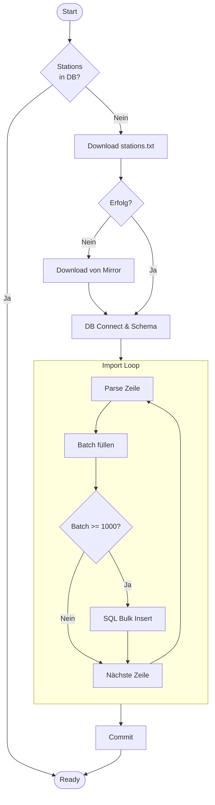

# import_stations.py

### Ablauf

```mermaid
flowchart TD
    Start([Start]) --> Check{Stations<br/>in DB?}
    Check -- Ja --> End([Ready])
    Check -- Nein --> Download[Download stations.txt]
    
    Download --> DL_Check{Erfolg?}
    DL_Check -- Nein --> Fallback[Download von Mirror]
    Fallback --> InitDB
    DL_Check -- Ja --> InitDB
    
    InitDB[DB Connect & Schema] --> Import
    
    subgraph Import [Import Loop]
        direction TB
        Parse[Parse Zeile] --> Batch[Batch füllen]
        Batch --> Limit{Batch >= 1000?}
        Limit -- Ja --> Insert[SQL Bulk Insert]
        Limit -- Nein --> Next
        Insert --> Next[Nächste Zeile]
        Next --> Parse
    end
    
    Import --> Commit[Commit]
    Commit --> End
```
### Main Orchestrierung (`main`)
Die `main`-Funktion koordiniert den Download und den Import der globalen Wetterstations-Metadaten in die lokale Datenbank.

*   **Fallback-Mechanismus**: Versucht die Stationsliste von der primären Quelle zu laden und nutzt bei Fehlern eine alternative NOAA-Quelle, um die Robustheit des Setups zu erhöhen.
*   **Datenbank-Setup**: Stellt die Verbindung zur SQLite-DB her und stellt über `create_schema` sicher, dass die erforderlichen Tabellen existieren.
*   **Transformation**: Führt den eigentlichen Import der Textdaten in die relationale Struktur der Datenbank durch.
*   **Ressourcen-Cleanup**: Schließt die Datenbankverbindung sauber ab, sobald der Importvorgang beendet ist.

### Download File (`download_file`)
Die Funktion `download_file` lädt eine Datei von einer URL herunter und speichert sie lokal, falls sie nicht bereits existiert.

*   **Existenzprüfung**: Prüft, ob die Datei bereits heruntergeladen wurde, um unnötigen Traffic zu vermeiden.
*   **Streaming**: Lädt die Datei in Chunks (Häppchenweise), um den Arbeitsspeicher bei großen Dateien nicht zu überlasten.
*   **Fortschritt**: Misst die Dauer des Downloads und gibt Größe und Zeit aus.

### DB Schema (`create_schema`)
`create_schema` definiert das Datenbankschema für die Wetterstationen.

*   **Tabelle `stations`**: Legt die Tabelle an, falls sie nicht existiert. Speichert ID, Koordinaten, Höhe, Staat, Name und diverse Flags.
*   **Indizes**: Erstellt Indizes auf `lat` (Breitengrad) und `lon` (Längengrad), um räumliche Abfragen (wie "Finde Stationen im Umkreis") massiv zu beschleunigen.

### Parse Stationzeile (`parse_station_line`)
Diese Hilfsfunktion parst eine einzelne Zeile der NOAA-Textdatei (Fixed-Width Format).

*   **Fixed-Width Parsing**: Extrahiert Datenblöcke anhand fester Zeichenpositionen (z.B. Zeichen 0-11 für die ID).
*   **Bereinigung**: Entfernt Leerzeichen (`strip()`) und konvertiert Strings in passende Datentypen (`float` für Koordinaten).

### Import Logic (`import_stations`)
`import_stations` liest die Textdatei zeilenweise und importiert die Daten in die SQLite-Datenbank.

*   **Transaktion**: Startet eine Transaktion (`BEGIN`), um Datenkonsistenz zu gewährleisten und den Import zu beschleunigen.
*   **Batch-Processing**: Sammelt 1000 Einträge ("Chunks"), bevor sie gesammelt in die Datenbank geschrieben werden (`executemany`). Dies ist deutlich schneller als jeder einzelne Insert.
*   **Fehlertoleranz**: Nutzt `errors="replace"` beim Lesen der Datei, um bei unbekannten Sonderzeichen nicht abzustürzen.

### Init Check (`ensure_stations_imported`)
Diese Funktion stellt sicher, dass die Datenbank beim Start bereit ist.

*   **Prüfung**: Checkt zuerst, ob die Datenbank bereits gefüllt ist (`COUNT > 0`). Falls ja, wird der Import übersprungen ("Short-Circuit").
*   **Orchestrierung**: Falls leer, stößt sie den Download und anschließend den Import an.
*   **Rückgabewerte**: Liefert Statistiken zurück, die vom Backend-Status-Endpoint genutzt werden.
