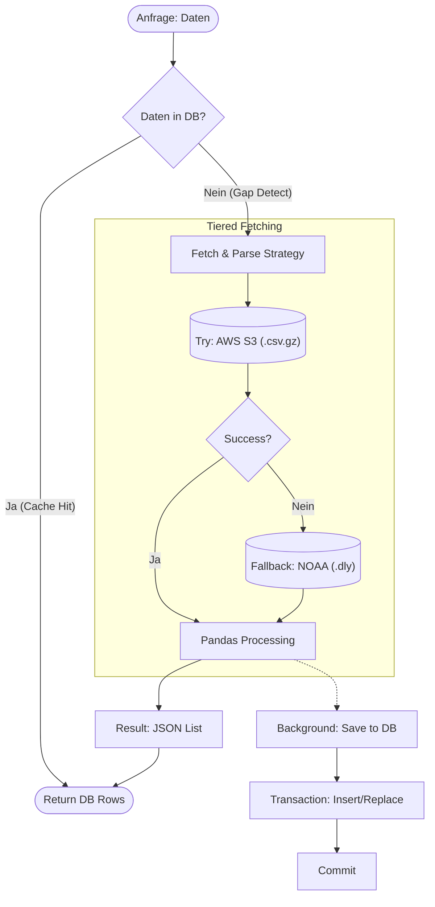

# import_temps.py

### Ablauf



### Download Data

??? "Details anzeigen"
    ```python
            def download_from_ncei(station_id: str, dest: Path) -> None:
            dest.parent.mkdir(parents=True, exist_ok=True)
            if dest.exists() and dest.stat().st_size > 0:
                return

            url = f"{DLY_BASE_URL}/{station_id}.dly"
            print(f"Downloading {url} -> {dest}")
            with requests.get(url, stream=True, timeout=60) as r:
                r.raise_for_status()
                with open(dest, "wb") as f:
                    for chunk in r.iter_content(chunk_size=1024 * 1024):
                        if chunk:
                            f.write(chunk)

        def download_from_s3(station_id: str, dest: Path) -> None:
            dest.parent.mkdir(parents=True, exist_ok=True)
            if dest.exists() and dest.stat().st_size > 0:
                return

            url = f"{S3_BASE_URL}/csv.gz/by_station/{station_id}.csv.gz"
            print(f"Downloading {url} -> {dest}")
            with requests.get(url, stream=True, timeout=30) as r:
                r.raise_for_status()
                with open(dest, "wb") as f:
                    for chunk in r.iter_content(chunk_size=1024 * 1024):
                        if chunk:
                            f.write(chunk)
    ```

    Diese Funktionen implementieren die Low-Level-Netzwerklogik für den Datenerwerb.

    *   **Effizienz**: Nutzt Stream-Verarbeitung (`stream=True` und `iter_content`), um auch große Dateien speicherschonend herunterzuladen, ohne den gesamten Dateiinhalt in den RAM zu laden.
    *   **Caching**: Prüft vor dem Download via `dest.exists()`, ob die Datei bereits lokal vorliegt ("Don't repeat yourself").
    *   **Dual-Source-Strategie**:
        *   `download_from_s3`: Der bevorzugte Weg. Lädt vorkomprimierte gzip-CSVs von einem schnellen S3-Cloud-Speicher (optimiert für Bulk-Zugriffe).
        *   `download_from_ncei`: Der Fallback-Weg. Lädt die operativen `.dly`-Dateien direkt von den NOAA-Regierungsservern, falls S3 nicht erreichbar oder veraltet ist.

### Load Data
??? Code 
    ```
            def _load_dly_data(station_id: str, start_year: Optional[int], end_year: Optional[int], ignore_qflag: bool) -> pd.DataFrame:
        dly_path = DATA_DIR / f"{station_id}.dly"
        try:
            download_from_ncei(station_id, dly_path)
        except Exception as e:
            print(f"NCEI Download failed: {e}")
            return pd.DataFrame()

        colspecs = [(0, 11), (11, 15), (15, 17), (17, 21)]
        names = ["station_id", "year", "month", "element"]
        
        for i in range(1, 32):
            start = 21 + (i - 1) * 8
            colspecs.append((start, start + 5))      
            colspecs.append((start + 6, start + 7)) 
            names.append(f"v{i}")
            names.append(f"q{i}")

        try:
            df = pd.read_fwf(
                dly_path, 
                colspecs=colspecs, 
                names=names, 
                header=None,
                dtype={"station_id": str, "year": int, "month": int, "element": str}
            )
        except Exception as e:
            print(f"Error reading {dly_path}: {e}")
            return pd.DataFrame()

        if df.empty:
            return pd.DataFrame()

        if start_year:
            df = df[df["year"] >= start_year]
        if end_year:
            df = df[df["year"] <= end_year]

        df = df[df["element"].isin(["TMAX", "TMIN"])]

        id_vars = ["station_id", "year", "month", "element"]
        val_vars = [f"v{i}" for i in range(1, 32)]
        df_v = df.melt(id_vars=id_vars, value_vars=val_vars, var_name="day_raw", value_name="value")
        
        q_vars = [f"q{i}" for i in range(1, 32)]
        df_q = df.melt(id_vars=id_vars, value_vars=q_vars, var_name="day_q_raw", value_name="qflag")
        
        df_v["qflag"] = df_q["qflag"]
        df_v = df_v[df_v["value"] != MISSING]
        
        if ignore_qflag:
            mask_valid = df_v["qflag"].isna() | (df_v["qflag"].astype(str).str.strip() == "")
            df_v = df_v[mask_valid]
        
        return df_v
    ```
    Der Parser für das klassische, komplexe **NOAA GHCN-Daily Format** (`.dly`).

    *   **Format-Handling**: Dieses Format ist "Fixed-Width" (feste Spaltenbreiten) und extrem kompakt, aber schwer zu lesen. Jede Zeile enthält die Messwerte eines ganzen Monats (31 Tage).
    *   **Pandas**: Nutzt `pd.read_fwf` mit exakt definierten `colspecs` (Spaltenpositionen), um die Struktur korrekt zu interpretieren.
    *   **Transformation**: Da das Ausgangsformat "breit" ist (Spalten v1..v31), nutzt die Funktion `pd.melt`, um es in ein modernes "Long-Format" (eine Zeile pro Tag: Datum, Wert) zu pivotieren. Das ist essenziell für die weitere Zeitreihenanalyse.
    *   **Qualitätssicherung**: Filtert Datenpunkte anhand der "Quality Flags" (`qflag`). Wenn `ignore_qflag=True` gesetzt ist, werden nur validierte Messwerte akzeptiert.

### Load Station Data
??? Code 
    ```
    def _load_s3_data(station_id: str, start_year: Optional[int], end_year: Optional[int], ignore_qflag: bool) -> pd.DataFrame:
    csv_path = S3_DATA_DIR / f"{station_id}.csv.gz"
    
    try:
        download_from_s3(station_id, csv_path)
    except Exception as e:
        print(f"S3 Download failed: {e}")
        if csv_path.exists() and csv_path.stat().st_size == 0:
             csv_path.unlink()
        raise e 

    names = ["station_id", "date", "element", "value", "mflag", "qflag", "sflag", "obstime"]
    
    try:
        df = pd.read_csv(csv_path, names=names, header=None, usecols=["station_id", "date", "element", "value", "qflag"], dtype={"station_id": str, "date": str, "element": str, "value": float})
    except Exception as e:
        print(f"Error reading S3 CSV {csv_path}: {e}")
        raise e

    if df.empty:
        return pd.DataFrame()

    df["year"] = df["date"].str.slice(0, 4).astype(int)
    df["month"] = df["date"].str.slice(4, 6).astype(int)

    if start_year:
        df = df[df["year"] >= start_year]
    if end_year:
        df = df[df["year"] <= end_year]

    df = df[df["element"].isin(["TMAX", "TMIN"])]
    
    if ignore_qflag:
        mask_valid = df["qflag"].isna() | (df["qflag"].astype(str).str.strip() == "")
        df = df[mask_valid]

    return df[["station_id", "year", "month", "element", "value"]]
    ```
    Der Parser für das moderne, optimierte **CSV-Format** aus dem S3-Bucket.

    *   **High-Performance**: Im Gegensatz zum DLY-Format ist dieses CSV bereits im "Long-Format".
    *   **Ressourcen-Schonung**: Nutzt `usecols`, um nur die zwingend benötigten Spalten (ID, Datum, Element, Wert) einzulesen. Das spart massiv Arbeitsspeicher, da irrelevante Metadaten direkt beim Einlesen verworfen werden.
    *   **Robustheit**: Enthält Logik, um korrupte Downloads (z.B. 0-Byte-Dateien nach Abbruch) zu erkennen, zu löschen und beim nächsten Mal sauber neu zu laden.
    *   **Vorfilterung**: Filtert schon beim Laden nach Jahren (`start_year`, `end_year`) und Elementen (`TMAX`, `TMIN`), um den DataFrame so klein wie möglich zu halten.
### Process Data
??? Code 
    ```
    def _process_weather_data(df_v: pd.DataFrame, start_year: Optional[int], end_year: Optional[int]) -> List[Tuple]:
    if df_v.empty:
        return []

    df_v["value"] = df_v["value"] / 10.0

    df_v["season"] = df_v["month"].map({
        3: "spring", 4: "spring", 5: "spring",
        6: "summer", 7: "summer", 8: "summer",
        9: "autumn", 10: "autumn", 11: "autumn",
        12: "winter", 1: "winter", 2: "winter"
    })
    
    df_v["season_year"] = df_v["year"]
    df_v.loc[df_v["month"] == 12, "season_year"] += 1

    grp_annual = df_v.groupby(["station_id", "year", "element"])["value"].agg(["mean", "count"])
    grp_annual = grp_annual.unstack("element") 
    grp_annual.columns = [f"{x}_{y}" for x, y in grp_annual.columns]
    grp_annual = grp_annual.reset_index()
    grp_annual["period"] = "annual"
    
    grp_seasonal = df_v.groupby(["station_id", "season_year", "season", "element"])["value"].agg(["mean", "count"])
    grp_seasonal = grp_seasonal.unstack("element")
    grp_seasonal.columns = [f"{x}_{y}" for x, y in grp_seasonal.columns]
    grp_seasonal = grp_seasonal.reset_index()
    grp_seasonal = grp_seasonal.rename(columns={"season_year": "year", "season": "period"})
    
    final_df = pd.concat([grp_annual, grp_seasonal], ignore_index=True)
    
    expected_cols = ["mean_TMAX", "mean_TMIN", "count_TMAX", "count_TMIN"]
    for c in expected_cols:
        if c not in final_df.columns:
            final_df[c] = np.nan
            
    final_df["count_TMAX"] = final_df["count_TMAX"].fillna(0).astype(int)
    final_df["count_TMIN"] = final_df["count_TMIN"].fillna(0).astype(int)
    
    results = []
    recs = final_df.to_dict(orient="records")
    
    def clean_val(v):
        try:
            f = float(v)
            if np.isnan(f) or np.isinf(f):
                return None
            return f
        except (ValueError, TypeError):
            return None

    for r in recs:
        y = r["year"]
        if start_year and y < start_year: continue
        if end_year and y > end_year: continue
        
        results.append((
            r["station_id"],
            int(r["year"]),
            r["period"],
            clean_val(r.get("mean_TMAX")),
            clean_val(r.get("mean_TMIN")),
            int(r.get("count_TMAX", 0)),
            int(r.get("count_TMIN", 0)),
        ))
    
    import json
    for i, row in enumerate(results):
        try:
            json.dumps(row[3], allow_nan=False)
            json.dumps(row[4], allow_nan=False)
        except (ValueError, TypeError) as e:
            # print(f"JSON COMPLIANCE FAILURE [index {i}]: {row[3]}, {row[4]} ERROR: {e}")
            lst = list(row)
            lst[3] = None
            lst[4] = None
            results[i] = tuple(lst)
            
    return results
    ```
    Das "Gehirn" der Datenverarbeitung. Hier werden Rohdaten in nutzbare Statistiken verwandelt.

    *   **Einheiten-Konvertierung**: Wandelt die NOAA-interne Speicherung (Zehntel-Grad Celsius) in menschenlesbare Grad Celsius um (`/ 10.0`).
    *   **Meteorologische Logik**: Ordnet Monate den korrekten Jahreszeiten zu (z.B. Dezember = Winter).
        *   *Besonderheit*: Der meteorologische Winter erstreckt sich über den Jahreswechsel (Dezember eines Jahres gehört zum Winter des *nächsten* Jahres). Diese komplexe Logik wird hier korrekt abgebildet (`season_year`).
    *   **Aggregation**: Nutzt die enorme Geschwindigkeit von Pandas `groupby`-Operationen, um Tausende Tageswerte in Sekundenbruchteilen zu aggregieren:
        *   `annual`: Berechnet Jahresdurchschnitte.
        *   `seasonal`: Berechnet Durchschnittswerte pro Jahreszeit.
    *   **Data Cleaning**: Stellt sicher, dass das Ergebnis JSON-konform ist (ersetzt `NaN` durch `None`) und garantiert eine konsistente Struktur für das Frontend, selbst wenn Daten für bestimmte Perioden fehlen.
### Station Period Data
??? Code 
    ```
        def fetch_and_parse_station_periods(
        station_id: str,
        ignore_qflag: bool = True,
        start_year: Optional[int] = None,
        end_year: Optional[int] = None,
    ) -> List[Tuple]:
        
        try:
            start_t = time.time()
            df = _load_s3_data(station_id, start_year, end_year, ignore_qflag)
            if not df.empty:
                elapsed = time.time() - start_t
                print(f"AWS Loading Time: {elapsed:.2f}s", flush=True)
                return _process_weather_data(df, start_year, end_year)
            print("S3 data empty, falling back...", flush=True)
        except Exception as e:
            print(f"S3 fetch failed ({e}), falling back to NCEI DLY...", flush=True)

        start_t = time.time()
        df = _load_dly_data(station_id, start_year, end_year, ignore_qflag)
        elapsed = time.time() - start_t
        print(f"NCEI Loading Time: {elapsed:.2f}s", flush=True)
        return _process_weather_data(df, start_year, end_year)
    ```
    Dies ist der **Orchestrator** für die Datenbeschaffung ("Controller"-Logik).

    *   **Tiered Fallback**: Setzt das "Try-Catch-Fallback"-Pattern um.
        1.  Versucht zuerst den **S3-Download** (schnell, günstig, zuverlässig).
        2.  Fängt jegliche Netzwerk- oder Parsingfehler ab.
        3.  Schaltet bei Problemen automatisch auf den **NCEI-Download** um (langsam, aber "Source of Truth").
    *   **Transparenz**: Gibt über `print`-Statements (die im Docker-Log landen) Auskunft über die genutzte Quelle und die benötigte Zeit. Das ist wichtiges Debugging-Feedback für den Admin.
### Save Station to DB
??? Code 
    ```
    def save_station_periods_to_db(conn: sqlite3.Connection, rows: List[Tuple]) -> None:
    conn.executemany(
        """
        INSERT OR REPLACE INTO station_temp_period
          (station_id, year, period, avg_tmax_c, avg_tmin_c, n_tmax, n_tmin)
        VALUES (?, ?, ?, ?, ?, ?, ?);
        """,
        rows,
    )
    conn.commit()
    ```
    Kapselt den Schreibzugriff auf die SQLite-Datenbank.

    *   **Idempotenz**: Nutzt `INSERT OR REPLACE`. Das bedeutet, man kann die Funktion gefahrlos mehrfach aufrufen – existierende Einträge werden aktualisiert, neue hinzugefügt. Es entstehen keine Duplikate.
    *   **Batching**: Nutzt `executemany` für hohe Schreibgeschwindigkeit (weniger Roundtrips zur DB-Engine als bei einzelnen Inserts).
    *   **Transaktionssicherheit**: Führt am Ende ein explizites `commit()` aus, um die Änderungen dauerhaft zu speichern.
### Import Station Periods
??? Code 
    ```
    def import_station_periods(
        station_id: str,
        conn: sqlite3.Connection,
        ignore_qflag: bool = True,
        start_year: Optional[int] = None,
        end_year: Optional[int] = None,
    ) -> None:
        rows = fetch_and_parse_station_periods(
            station_id, ignore_qflag, start_year, end_year
        )
        save_station_periods_to_db(conn, rows)
    ```
    Eine Wrapper-Funktion ("Fassade"), die den gesamten Prozess "Hole Daten -> Verarbeite sie -> Speicher sie" in einem einzigen Aufruf bündelt. Dies vereinfacht die Aufrufe an anderen Stellen im Code (z.B. im Startup-Skript oder bei Hintergrund-Tasks), da sie sich nicht um die Details von Pandas oder SQL kümmern müssen.
### Years to Block
??? Code 
    ```
    def _years_to_blocks(years: List[int]) -> List[Tuple[int, int]]:
        if not years:
            return []
        blocks: List[Tuple[int, int]] = []
        start = prev = years[0]
        for y in years[1:]:
            if y == prev + 1:
                prev = y
            else:
                blocks.append((start, prev))
                start = prev = y
        blocks.append((start, prev))
        return blocks
    ```
    Ein intelligenter Algorithmus zur **Lücken-Optimierung**.

    *   **Problem**: Wenn ein Nutzer erst 1990-2000 abfragt und später 2005-2010 braucht, haben wir eine Liste fehlender Jahre: `[1990, 1991, ..., 2005, 2006, ...]`. Einzeln laden wäre ineffizient.
    *   **Lösung**: Diese Funktion erkennt zusammenhängende Sequenzen ("Runs") in einer Liste von Zahlen.
        *   Input: `[1990, 1991, 1992, 2005, 2006]`
        *   Output: `[(1990, 1992), (2005, 2006)]`
    *   **Vorteil**: Erlaubt es dem System, fehlende Daten in großen, zusammenhängenden Blöcken nachzuladen, statt jahresweise.
### Ensure Station Period Range
??? Code 
    ```
        def ensure_station_periods_range(
        station_id: str,
        conn: sqlite3.Connection,
        start_year: Optional[int],
        end_year: Optional[int],
    ) -> dict:
        create_schema(conn)

        if start_year is None or end_year is None:
            import_station_periods(station_id, conn)
            return {"imported": True, "mode": "full", "blocks": None}

        start_year = int(start_year)
        end_year = int(end_year)
        if start_year > end_year:
            raise ValueError("start_year must be <= end_year")

        existing_rows = conn.execute(
            """
            SELECT DISTINCT year
            FROM station_temp_period
            WHERE station_id = ?
            AND period = 'annual'
            AND year BETWEEN ? AND ?;
            """,
            (station_id, start_year, end_year),
        ).fetchall()

        existing_years = {int(r[0]) for r in existing_rows}
        requested_years = set(range(start_year, end_year + 1))
        missing_years = sorted(requested_years - existing_years)

        if not missing_years:
            return {
                "imported": False,
                "mode": "range",
                "missing_years_count": 0,
                "blocks": [],
            }

        blocks = _years_to_blocks(missing_years)

        for (a, b) in blocks:
            import_station_periods(station_id, conn, start_year=a, end_year=b)

        return {
            "imported": True,
            "mode": "range",
            "missing_years_count": len(missing_years),
            "blocks": [{"start_year": a, "end_year": b} for (a, b) in blocks],
        }
    ```
    Das Herzstück der **intelligenten Synchronisation**.

    *   **Differenz-Analyse**: Statt blind Daten zu laden, fragt diese Funktion zuerst die Datenbank: "Welche Jahre habe ich schon für Station X im Bereich Y bis Z?".
    *   **Mengenlehre**: Berechnet die Differenzmenge `Gefragt - Vorhanden = Fehlend`.
    *   **Smart Loading**:
        *   Ist die Differenz leer (`missing_years_count: 0`), kehrt die Funktion sofort zurück. (Cache Hit!)
        *   Gibt es Lücken, werden nur diese spezifischen Jahre via `_years_to_blocks` und `import_station_periods` nachgeladen.
    *   **Fehler-Prävention**: Validiert Input (Startjahr <= Endjahr) und stellt sicher, dass das DB-Schema existiert.
### Get Station Periods
??? Code 
    ```
        def get_station_periods(
        station_id: str,
        conn: sqlite3.Connection,
        start_year: Optional[int] = None,
        end_year: Optional[int] = None,
    ) -> List[dict]:
        create_schema(conn)

        sql = """
        SELECT year, period, avg_tmax_c, avg_tmin_c, n_tmax, n_tmin
        FROM station_temp_period
        WHERE station_id = ?
        """
        params: List[object] = [station_id]

        if start_year is not None:
            sql += " AND year >= ?"
            params.append(int(start_year))

        if end_year is not None:
            sql += " AND year <= ?"
            params.append(int(end_year))

        sql += " ORDER BY year, period;"

        conn.row_factory = sqlite3.Row
        rows = conn.execute(sql, params).fetchall()
        return [dict(r) for r in rows]
    ```
    Die **Public Read-Schnittstelle** für Temperaturdaten.

    *   **Fokussiert**: Diese Funktion kümmert sich *nur* um das Lesen ("Query"). Sie löst keine Downloads aus (das passiert vorher oder im Hintergrund).
    *   **Filterung**: Baut dynamisches SQL basierend auf den optionalen Parametern `start_year` und `end_year`.
    *   **Formatierung**: Konvertiert die rohen Datenbankzeilen (`sqlite3.Row`) in Python-Dictionaries, die direkt von FastAPI als JSON an das Frontend geschickt werden können.
    *   **Ordnung**: Garantiert durch `ORDER BY year, period`, dass die Zeitreihe chronologisch korrekt beim Client ankommt.
### Station Schema
??? Code 
    ```
    def create_schema(conn: sqlite3.Connection) -> None:
        conn.executescript(
            """
            CREATE TABLE IF NOT EXISTS station_temp_period (
                station_id   TEXT NOT NULL,
                year         INTEGER NOT NULL,
                period       TEXT NOT NULL,   
                avg_tmax_c   REAL,
                avg_tmin_c   REAL,
                n_tmax       INTEGER NOT NULL,
                n_tmin       INTEGER NOT NULL,
                PRIMARY KEY (station_id, year, period)
            );
            CREATE INDEX IF NOT EXISTS idx_temp_period_station_year
            ON station_temp_period (station_id, year);
            """
        )
        conn.commit()
    ```
    Definiert die **Datenbank-Struktur** (DDL).

    *   **Composite Primary Key**: Der Primärschlüssel `(station_id, year, period)` stellt sicher, dass es pro Station, Jahr und Zeitraum (z.B. "Winter 2023") genau einen Datensatz gibt.
    *   **Performance-Indizes**: Setzt einen Index auf `(station_id, year)`. Das ist entscheidend, damit Abfragen wie "Gib mir alle Daten von Station X zwischen 1950 und 2000" blitzschnell sind und keinen "Full Table Scan" benötigen.
    *   **Idempotenz**: `CREATE TABLE IF NOT EXISTS` verhindert Fehler, wenn die App neu startet.
