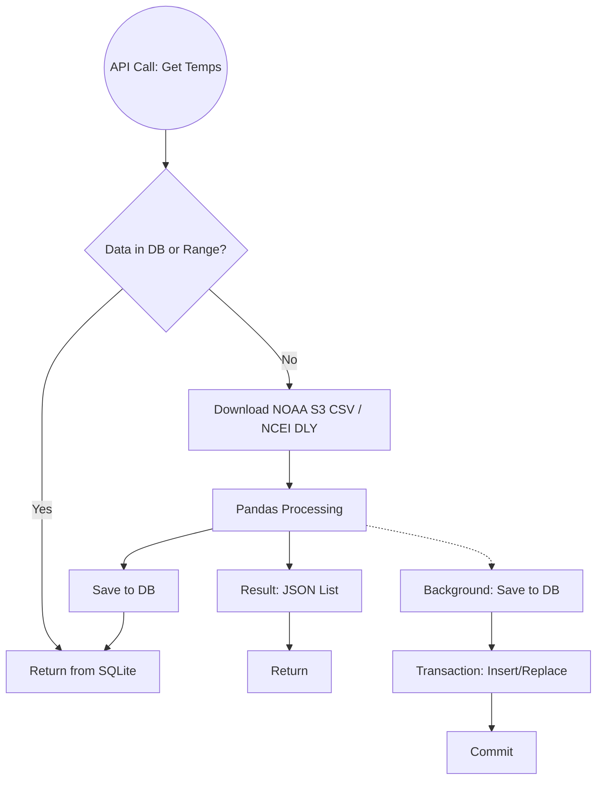

# import_temps.py

### Ablauf

```mermaid
graph TD;
        Start((API Call: Get Temps)) --> CheckDB{Data in DB or Range?};
        CheckDB -- Yes --> Serve[Return from SQLite];
        CheckDB -- No --> FetchS3[Download NOAA S3 CSV / NCEI DLY];
        FetchS3 --> Process[Aggregate Daily CSV into Monthly/Seasons using Pandas];
        Process --> DBStore[Save to DB];
        DBStore --> Serve;
    
    Process[Pandas Processing] --> Clean[Result: JSON List]
    Clean --> Return
    
    Process -.-> BgSave[Background: Save to DB]
    BgSave --> Trans[Transaction: Insert/Replace]
    Trans --> Commit[Commit]
```
### Fetch Operations
Die Pipeline beginnt bei der Feststellung eines Cache-Miss.

    *   `download_from_s3`: Bezieht die komprimierten **Daily Summaries** (`.csv.gz`) von den AWS S3 Servern der NOAA. Das ist die priorisierte und schnellste API.
    *   `download_from_ncei`: Dient als Fallback, falls S3 fehlschlägt. Bezieht gigantische Textdateien (`.dly`) mit historischen Werten in Fixed-Width-Format direkt vom NOAA NCEI Archiv.

### Load Data (`_load_s3_data` / `_load_dly_data`)
    Der Parser abstrahiert das Format-Chaos der NOAA:
    *   DLY: Zerschneidet die 31-Wert Spalten (`v1`, `v2`, ... `v31`) in ein nutzbares Array und schmilzt sie per Pandas `melt` zusammen.
    *   S3: Gliedert die sauberen Spalten und Datumsangaben.
    *   Beide Loads schneiden fehlerhafte Einträge via QA Flags (`qflag`) heraus, sortieren falsche IDs aus und ignorieren Messfehler (`-9999`).
### Process Data (`_process_weather_data`)
    Das "Gehirn" der Datenverarbeitung. Hier werden Rohdaten in nutzbare Statistiken verwandelt.

    *   **Einheiten-Konvertierung**: Wandelt die NOAA-interne Speicherung (Zehntel-Grad Celsius) in menschenlesbare Grad Celsius um (`/ 10.0`).
    *   **Meteorologische Logik**: Ordnet Monate den korrekten Jahreszeiten zu (z.B. Dezember = Winter).
        *   *Besonderheit*: Der meteorologische Winter erstreckt sich über den Jahreswechsel (Dezember eines Jahres gehört zum Winter des *nächsten* Jahres). Diese komplexe Logik wird hier korrekt abgebildet (`season_year`).
    *   **Tages-zu-Monats Aggregation**: Die frisch bezogenen Tageswerte werden _zunächst_ auf einen Monat aggregiert. Das ist immens wichtig, damit ein einzelner fehlender Messtag das aggregierte Durchschnittsjahr später nicht hart verfälscht.
    *   **Aggregation der Perioden**: Nutzt die Geschwindigkeit von Pandas `groupby`, um die errechneten Monate weiter zusammenzufassen:
        *   `annual`: Berechnet Jahresdurchschnitte.
        *   `seasonal`: Berechnet Durchschnittswerte pro Jahreszeit.
    *   **Data Cleaning**: Stellt sicher, dass das Ergebnis JSON-konform ist (ersetzt `NaN` durch `None`) und garantiert eine konsistente Struktur für das Frontend, selbst wenn Daten für bestimmte Perioden fehlen.
### Station Period Data (`fetch_and_parse_station_periods`)
    Dies ist der **Orchestrator** für die Datenbeschaffung ("Controller"-Logik).

    *   **Tiered Fallback**: Setzt das "Try-Catch-Fallback"-Pattern um.
        1.  Versucht zuerst den **S3-Download** (schnell, günstig, zuverlässig).
        2.  Fängt jegliche Netzwerk- oder Parsingfehler ab.
        3.  Schaltet bei Problemen automatisch auf den **NCEI-Download** um (langsam, aber "Source of Truth").
    *   **Transparenz**: Gibt über `print`-Statements (die im Docker-Log landen) Auskunft über die genutzte Quelle und die benötigte Zeit. Das ist wichtiges Debugging-Feedback für den Admin.
### Save Station to DB (`save_station_periods_to_db`)
    Kapselt den Schreibzugriff auf die SQLite-Datenbank.

    *   **Idempotenz**: Nutzt `INSERT OR REPLACE`. Das bedeutet, man kann die Funktion gefahrlos mehrfach aufrufen – existierende Einträge werden aktualisiert, neue hinzugefügt. Es entstehen keine Duplikate.
    *   **Batching**: Nutzt `executemany` für hohe Schreibgeschwindigkeit (weniger Roundtrips zur DB-Engine als bei einzelnen Inserts).
    *   **Transaktionssicherheit**: Führt am Ende ein explizites `commit()` aus, um die Änderungen dauerhaft zu speichern.
### Import Station Periods (`import_station_periods`)
    Eine Wrapper-Funktion ("Fassade"), die den gesamten Prozess "Hole Daten -> Verarbeite sie -> Speicher sie" in einem einzigen Aufruf bündelt. Dies vereinfacht die Aufrufe an anderen Stellen im Code (z.B. im Startup-Skript oder bei Hintergrund-Tasks), da sie sich nicht um die Details von Pandas oder SQL kümmern müssen.
### Years to Block (`_years_to_blocks`)
    Ein intelligenter Algorithmus zur **Lücken-Optimierung**.

    *   **Problem**: Wenn ein Nutzer erst 1990-2000 abfragt und später 2005-2010 braucht, haben wir eine Liste fehlender Jahre: `[1990, 1991, ..., 2005, 2006, ...]`. Einzeln laden wäre ineffizient.
    *   **Lösung**: Diese Funktion erkennt zusammenhängende Sequenzen ("Runs") in einer Liste von Zahlen.
        *   Input: `[1990, 1991, 1992, 2005, 2006]`
        *   Output: `[(1990, 1992), (2005, 2006)]`
    *   **Vorteil**: Erlaubt es dem System, fehlende Daten in großen, zusammenhängenden Blöcken nachzuladen, statt jahresweise.
### Ensure Station Period Range (`ensure_station_periods_range`)
    Das Herzstück der **intelligenten Synchronisation**.

    *   **Differenz-Analyse**: Statt blind Daten zu laden, fragt diese Funktion zuerst die Datenbank: "Welche Jahre habe ich schon für Station X im Bereich Y bis Z?".
    *   **Mengenlehre**: Berechnet die Differenzmenge `Gefragt - Vorhanden = Fehlend`.
    *   **Smart Loading**:
        *   Ist die Differenz leer (`missing_years_count: 0`), kehrt die Funktion sofort zurück. (Cache Hit!)
        *   Gibt es Lücken, werden nur diese spezifischen Jahre via `_years_to_blocks` und `import_station_periods` nachgeladen.
    *   **Fehler-Prävention**: Validiert Input (Startjahr <= Endjahr) und stellt sicher, dass das DB-Schema existiert.
### Get Station Periods (`get_station_periods`)
    Die **Public Read-Schnittstelle** für Temperaturdaten.

    *   **Fokussiert**: Diese Funktion kümmert sich *nur* um das Lesen ("Query"). Sie löst keine Downloads aus (das passiert vorher oder im Hintergrund).
    *   **Filterung**: Baut dynamisches SQL basierend auf den optionalen Parametern `start_year` und `end_year`.
    *   **Formatierung**: Konvertiert die rohen Datenbankzeilen (`sqlite3.Row`) in Python-Dictionaries, die direkt von FastAPI als JSON an das Frontend geschickt werden können.
    *   **Ordnung**: Garantiert durch `ORDER BY year, period`, dass die Zeitreihe chronologisch korrekt beim Client ankommt.
### Station Schema (`create_schema`)
    Definiert die **Datenbank-Struktur** (DDL).

    *   **Composite Primary Key**: Der Primärschlüssel `(station_id, year, period)` stellt sicher, dass es pro Station, Jahr und Zeitraum (z.B. "Winter 2023") genau einen Datensatz gibt.
    *   **Performance-Indizes**: Setzt einen Index auf `(station_id, year)`. Das ist entscheidend, damit Abfragen wie "Gib mir alle Daten von Station X zwischen 1950 und 2000" blitzschnell sind und keinen "Full Table Scan" benötigen.
    *   **Idempotenz**: `CREATE TABLE IF NOT EXISTS` verhindert Fehler, wenn die App neu startet.
