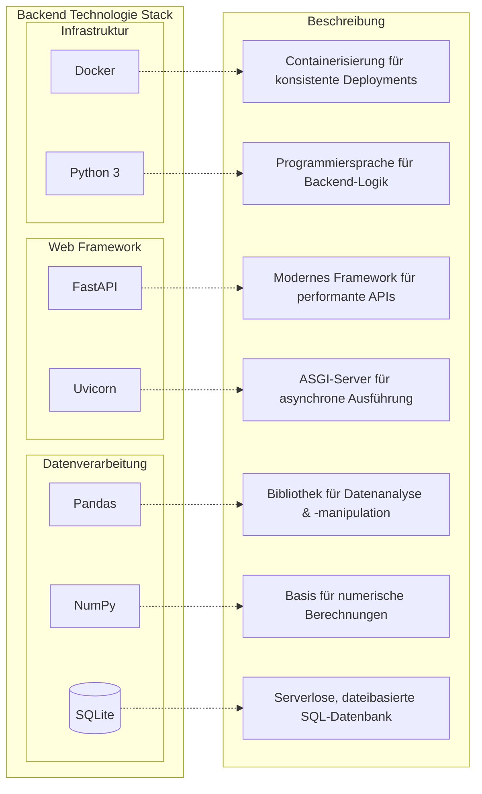
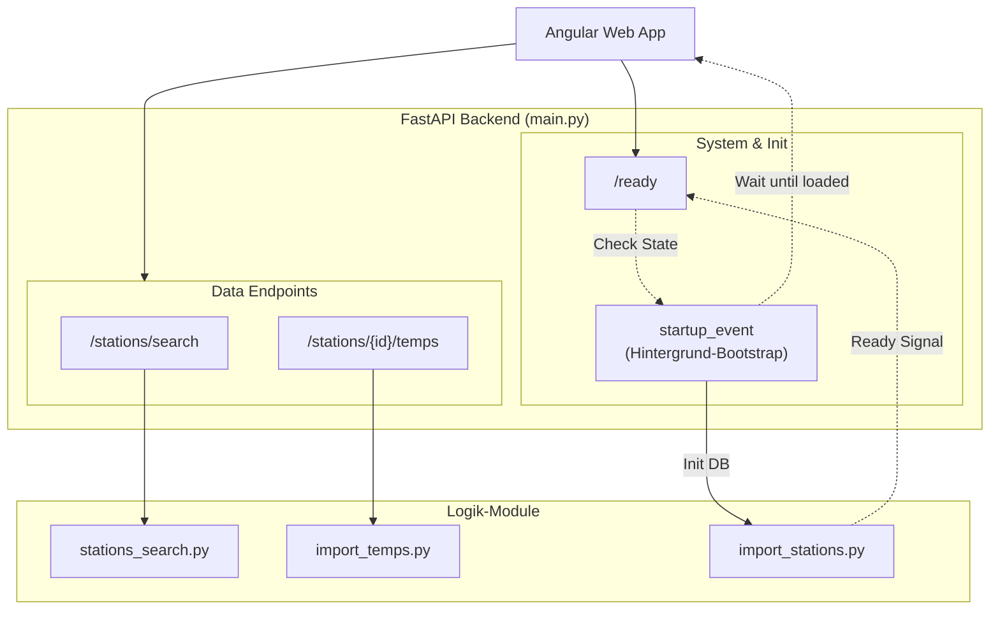

# Backend Documentation
## Struktur

```
weather-app-backend/
├── app/
│   ├── main.py             # Einstiegspunkt, API-Definitionen
│   ├── import_stations.py  # Skript zum Herunterladen von Stationsmetadaten
│   ├── import_temps.py     # Logik zum Herunterladen und Verarbeiten von Temperaturdaten
│   └── stations_search.py  # Räumliche Suchlogik (Haversine-Formel)
├── Dockerfile              # Container-Definition
```

## Technologie Stack



## Backend Architektur


