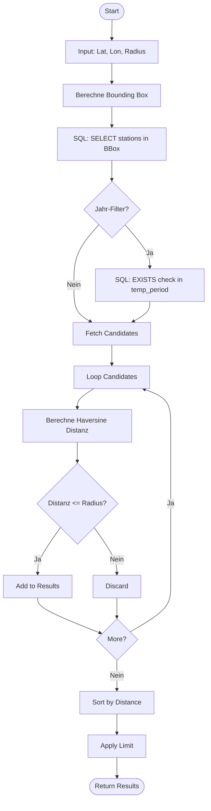

# stations_search.py

### Ablauf



### Haversine Distance
??? Code
    ```
    def haversine_distance(lat1: float, lon1: float, lat2: float, lon2: float) -> float:
    lat1_rad = math.radians(lat1)
    lon1_rad = math.radians(lon1)
    lat2_rad = math.radians(lat2)
    lon2_rad = math.radians(lon2)

    dlat = lat2_rad - lat1_rad
    dlon = lon2_rad - lon1_rad

    a = math.sin(dlat / 2) ** 2 + math.cos(lat1_rad) * \
        math.cos(lat2_rad) * math.sin(dlon / 2) ** 2
    c = 2 * math.asin(math.sqrt(a))
    return EARTH_RADIUS_KM * c
    ```

Berechnet die **Großkreis-Entfernung** (Luftlinie) zwischen zwei Punkten auf einer Kugel.
Dies ist notwendig, da die Erde keine Scheibe ist und einfache euklidische Distanzberechnungen auf globaler Skala zu ungenau wären.

### Bounding Box
??? Code
    ```
    def bounding_box(lat: float, lon: float, radius_km: float) -> Tuple[float, float, float, float]:
    lat_rad = math.radians(lat)

    delta_lat = radius_km / EARTH_RADIUS_KM
    cos_lat = max(0.000001, math.cos(lat_rad))
    delta_lon = radius_km / (EARTH_RADIUS_KM * cos_lat)

    min_lat = lat - math.degrees(delta_lat)
    max_lat = lat + math.degrees(delta_lat)
    min_lon = lon - math.degrees(delta_lon)
    max_lon = lon + math.degrees(delta_lon)
    return min_lat, max_lat, min_lon, max_lon
    ```

Erstellt ein **geografisches Rechteck** (Min/Max Latitude & Longitude) um den Mittelpunkt.
**Zweck**: Ein Rechteck lässt sich in SQL extrem effizient mit `BETWEEN` abfragen (unter Nutzung von Indizes). Das ist der "grobe Filter", bevor die teure `haversine_distance` für die Fein-Auswahl berechnet wird.

### Normalize Lon
??? Code
    ```
    def normalize_lon(lon: float) -> float:
    return (lon + 180.0) % 360.0 - 180.0
    ```

Hilfsfunktion, um Längengrade in den Bereich `[-180, 180]` zu normieren. Wichtig für Suchen, die die Datumsgrenze (Pazifik) überschreiten.

### Lon Ranges
??? Code
    ```
    def _lon_ranges(min_lon: float, max_lon: float) -> List[Tuple[float, float]]:
    min_lon = normalize_lon(min_lon)
    max_lon = normalize_lon(max_lon)
    if min_lon <= max_lon:
        return [(min_lon, max_lon)]
    return [(min_lon, 180.0), (-180.0, max_lon)]
    ```

Behandelt den **Datumsgrenzen-Spezialfall**: Wenn ein Suchradius über den 180. Längengrad hinausgeht (z.B. von Neuseeland Richtung Osten), muss die Suche in zwei separate Längengrad-Bereiche aufgeteilt werden (z.B. `[170, 180]` und `[-180, -170]`).

### Find Stations Nearby
??? Code
    ```
        def find_stations_nearby(
        lat: float,
        lon: float,
        radius_km: float,
        limit: int = 25,
        db_path: Union[str, Path] = DB_PATH,
        start_year: Optional[int] = None,
        end_year: Optional[int] = None,
    ) -> List[Dict[str, Any]]:
        if radius_km <= 0:
            return []

        limit = max(1, min(int(limit), 1000))
        db_path = Path(db_path)
        if not db_path.exists():
            raise FileNotFoundError(f"Database file not found at {db_path}")

        min_lat, max_lat, min_lon, max_lon = bounding_box(lat, lon, radius_km)
        
        # Basic bounding box query
        sql = """
        SELECT s.station_id, s.name, s.lat, s.lon
        FROM stations s
        WHERE s.lat BETWEEN ? AND ?
        AND s.lon BETWEEN ? AND ?
        """
        params = [min_lat, max_lat, min_lon, max_lon]

        # If year filtering is requested, check existence of data in range
        if start_year is not None and end_year is not None:
            sql += """
            AND EXISTS (
                SELECT 1 FROM station_temp_period p
                WHERE p.station_id = s.station_id
                AND p.year >= ? AND p.year <= ?
            )
            """
            params.extend([start_year, end_year])
        
        conn = sqlite3.connect(db_path)
        conn.row_factory = sqlite3.Row
        try:
            rows = conn.execute(sql, params).fetchall()
        finally:
            conn.close()

        results: List[Dict[str, Any]] = []
        for row in rows:
            st_lat = float(row["lat"])
            st_lon = float(row["lon"])
            d = haversine_distance(lat, lon, st_lat, st_lon)
            if d <= radius_km:
                results.append(
                    {
                        "station_id": row["station_id"],
                        "name": (row["name"] or "").strip(),
                        "lat": st_lat,
                        "lon": st_lon,
                        "distance_km": round(d, 3),
                    }
                )

        results.sort(key=lambda x: (x["distance_km"], x["station_id"]))
        return results[:limit]
    ```

Die Hauptfunktion für die Umkreissuche:

1.  **Grobfilter**: Nutzt `bounding_box`, um die SQL-Abfrage auf ein relevantes Fenster einzuschränken.
2.  **Verfügbarkeits-Check**: Falls `start_year`/`end_year` angegeben sind, prüft ein intelligentes `EXISTS`-Subquery, ob für die Station überhaupt Daten im Index vorliegen – ohne die eigentlichen Daten zu laden.
3.  **Feinfilter**: Iteriert über die SQL-Ergebnisse und berechnet die exakte `haversine_distance`. Nur Stationen innerhalb des echten Radius (Kreis vs. Rechteck) werden übernommen.
4.  **Ranking**: Sortiert die Treffer nach Distanz, damit der Nutzer die nächstgelegene Station zuerst sieht.
