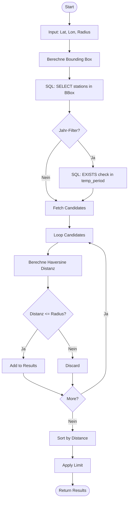

# stations_search.py

### Ablauf

```mermaid
flowchart TD
    Start([Start]) --> Input[Input: Lat, Lon, Radius]
    Input --> BBox[Berechne Bounding Box]
    BBox --> SQL[SQL: SELECT stations in BBox]
    
    SQL --> Filter{Jahr-Filter?}
    Filter -- Ja --> SQLEx[SQL: EXISTS check in temp_period]
    Filter -- Nein --> Fetch[Fetch Candidates]
    SQLEx --> Fetch

    Fetch --> Loop["Loop Candidates"]
    Loop --> Dist[Berechne Haversine Distanz]
    Dist --> CheckDist{Distanz <= Radius?}
    CheckDist -- Ja --> Add[Add to Results]
    CheckDist -- Nein --> Discard[Discard]
    
    Add --> Next{More?}
    Discard --> Next
    Next -- Ja --> Loop
    Next -- Nein --> Sort[Sort by Distance]
    
    Sort --> Limit[Apply Limit]
    Limit --> End([Return Results])
```

### Haversine Distance (`haversine_distance`)
Berechnet die **Großkreis-Entfernung** (Luftlinie) zwischen zwei Punkten auf einer Kugel.
Dies ist notwendig, da die Erde keine Scheibe ist und einfache euklidische Distanzberechnungen auf globaler Skala zu ungenau wären.

### Bounding Box (`bounding_box`)
Erstellt ein **geografisches Rechteck** (Min/Max Latitude & Longitude) um den Mittelpunkt.
**Zweck**: Ein Rechteck lässt sich in SQL extrem effizient mit `BETWEEN` abfragen (unter Nutzung von Indizes). Das ist der "grobe Filter", bevor die teure `haversine_distance` für die Fein-Auswahl berechnet wird.

### Normalize Längengrade (`normalize_lon`)
Hilfsfunktion, um Längengrade in den Bereich `[-180, 180]` zu normieren. Wichtig für Suchen, die die Datumsgrenze (Pazifik) überschreiten.

### Regionen Splitten (`_lon_ranges`)
Behandelt den **Datumsgrenzen-Spezialfall**: Wenn ein Suchradius über den 180. Längengrad hinausgeht (z.B. von Neuseeland Richtung Osten), muss die Suche in zwei separate Längengrad-Bereiche aufgeteilt werden (z.B. `[170, 180]` und `[-180, -170]`).

### Find Stations Nearby (`find_stations_nearby`)
Die Hauptfunktion für die Umkreissuche:

1.  **Grobfilter**: Nutzt `bounding_box`, um die SQL-Abfrage auf ein relevantes Fenster einzuschränken.
2.  **Verfügbarkeits-Check**: Falls `start_year`/`end_year` angegeben sind, prüft ein intelligentes `EXISTS`-Subquery, ob für die Station überhaupt Daten im Index vorliegen – ohne die eigentlichen Daten zu laden.
3.  **Feinfilter**: Iteriert über die SQL-Ergebnisse und berechnet die exakte `haversine_distance`. Nur Stationen innerhalb des echten Radius (Kreis vs. Rechteck) werden übernommen.
4.  **Ranking**: Sortiert die Treffer nach Distanz, damit der Nutzer die nächstgelegene Station zuerst sieht.
