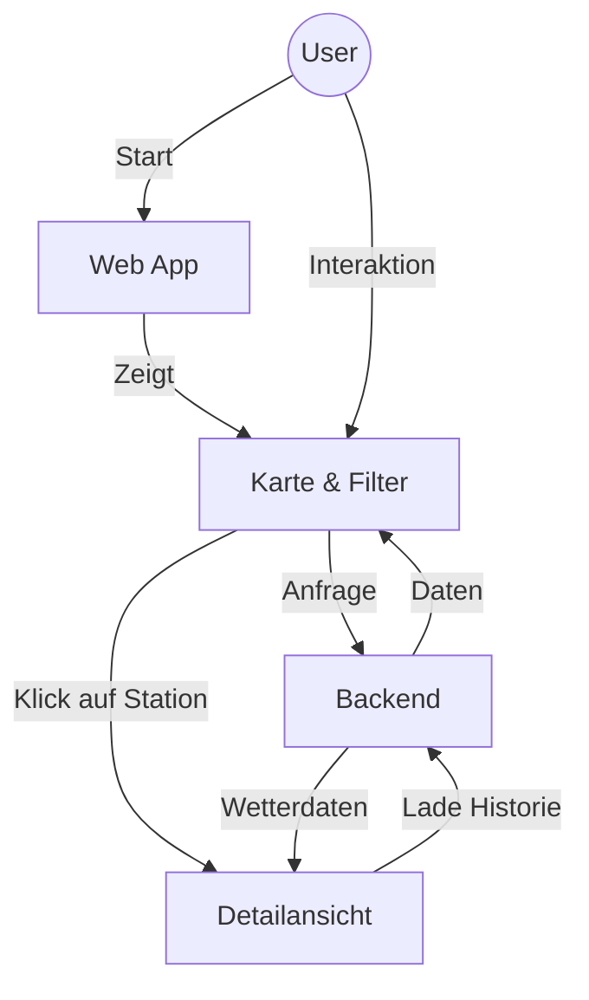

# Frontend Dokumentation

Das Frontend ist eine Single Page Application (SPA), die mit **Angular 19** erstellt und mit **PrimeNG** gestaltet wurde.

```
weather-app/
├── src/
│   ├── app/
│   │   ├── data-view-page/       # Main container component
│   │   ├── map-view/             # Leaflet map component
│   │   ├── settings-configuration/# Search & filter form
│   │   ├── pop-up-display/       # Chart popup component
│   │   ├── loading-screen/       # Global loading indicator
│   │   └── weather-api.service.ts# HTTP client service
│   └── styles.css                # Global styles
```

## Architektur & Ablauf



## State Management

Die Anwendung nutzt **Angular Signals** für reaktives State Management.

### StationUiStateService
Fungiert als zentrale "Source of Truth" (Wahrheitsquelle) für:
*   **Karten-Geometrie**: Der aktuelle Suchradius und die Position des zentralen Pins.
*   **Ergebnis-Sammlung**: Die Liste der Stationen, die bei der räumlichen Suche gefunden wurden.
*   **Kontextuelle Auswahl**: Die aktuell aktive Station für die Detailansicht.

## Visuelles Design

*   **PrimeNG V19**: Bildet das Fundament für interaktive Komponenten wie den Range Slider, Dialoge und Auswahlmenüs.
*   **Responsivität**: Nutzt Flexbox und Media Queries, um sich von Desktop-Monitoren bis hin zu kleineren Tablet-Ansichten anzupassen.
